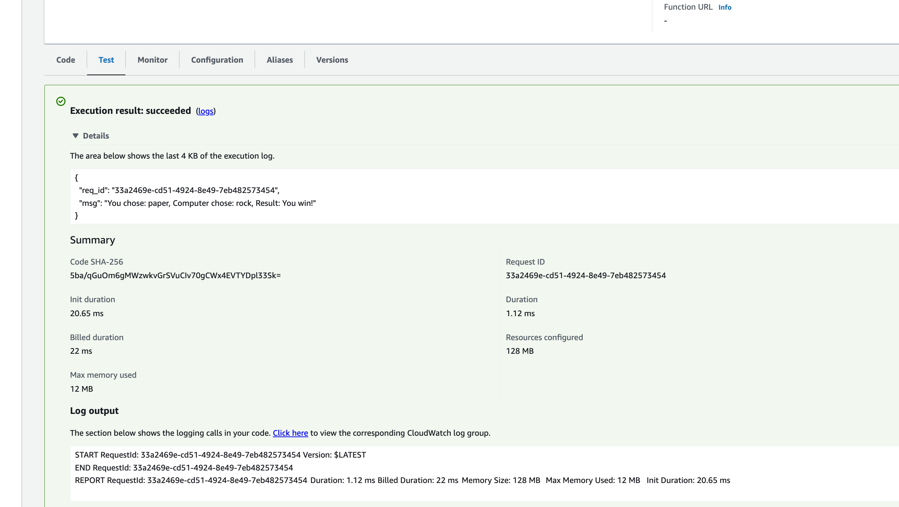

# A Rust CLI in an AWS Lambda Function.

## Goal
* Build a cli tool with Rust
* Deploy the project onto AWS by interacting with some cloud service, e.g. S3, Cloud9, Lambda
* Learn AWS (probably leverage S3, Cloud9 or Lambda) and Rust (mainly Clap in this project) as the project grows.

## Development and reproduce
```bash
# cargo install cargo-lambda (run if you have never installed it; this cmd can take some time to finish since it's going to compile the binary in your system)
cargo lambda new my-first-lambda-function

# write code..

# rustup target add x86_64-unknown-linux-musl (run if you have never installed it)
cargo build --release --target x86_64-unknown-linux-musl
cp target/x86_64-unknown-linux-musl/release/myfirstlambdafunction ./bootstrap
zip lambda.zip bootstrap
# I then use the AWS Lambda console to submit the zip file
```

## Test
```json
Input
{
  "choice": "paper"
}

Output
{
  "req_id": "33a2469e-cd51-4924-8e49-7eb482573454",
  "msg": "You chose: paper, Computer chose: rock, Result: You win!"
}
```



## References
* [Cargo-Lambda](https://crates.io/crates/cargo-lambda)
* [install-cargo-lambda](https://pypi.org/project/cargo-lambda/0.10.0rc1/)
* [aws-sdk-for-rust-lambda](https://docs.aws.amazon.com/sdk-for-rust/latest/dg/lambda.html)
* [aws-lambda-rust-runtime](https://github.com/awslabs/aws-lambda-rust-runtime#aws-cli)
* [marco-polo-lambda](https://github.com/nogibjj/rust-mlops-template/tree/main/marco-polo-lambda)

- [AWS-S3-tutorial-for-beginners-official](https://www.youtube.com/watch?v=tfU0JEZjcsg)
- [AWS-Learner-lab](https://labs.vocareum.com/web/2370068/1491694.0/ASNLIB/public/docs/lang/en-us/README.html#envNav)
- [AWS-Setup-Credentials](https://docs.aws.amazon.com/toolkit-for-vscode/latest/userguide/setup-credentials.html)
- [AWS-Learner-Lab](https://awsacademy.instructure.com/courses/37397)
* [Build-an-AWS-Lambda-Function-Deploy-in-Rust](https://www.youtube.com/watch?v=jUTiHUTfGYo)
* [Cloud-computing-for-data](https://paiml.com/docs/home/books/cloud-computing-for-data/)
* [rust-tutorial](https://nogibjj.github.io/rust-tutorial/chapter_1.html)
* [building-cloud-computing-solutions-at-scale-coursera](https://www.coursera.org/specializations/building-cloud-computing-solutions-at-scale)
* [rust-language-official-tool](https://doc.rust-lang.org/book/)
* [rust-cli-template](https://github.com/kbknapp/rust-cli-template)
* [command-line-rust](https://github.com/kyclark/command-line-rust)
